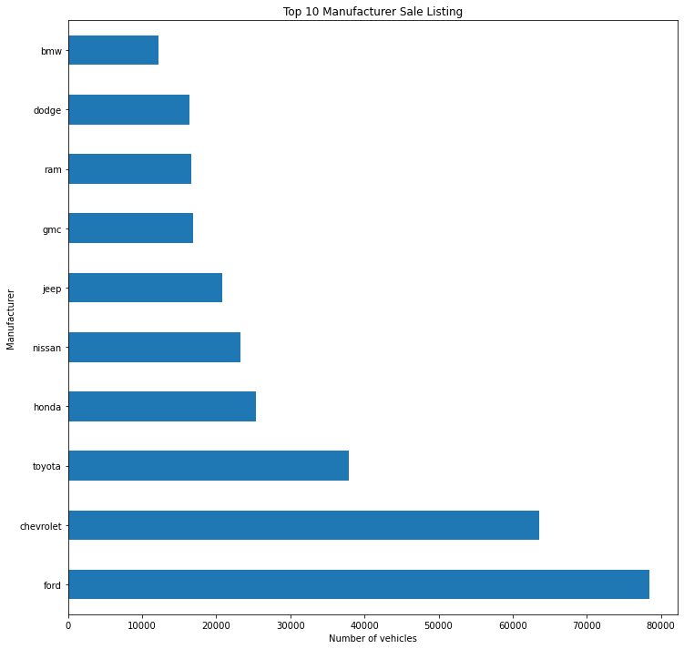
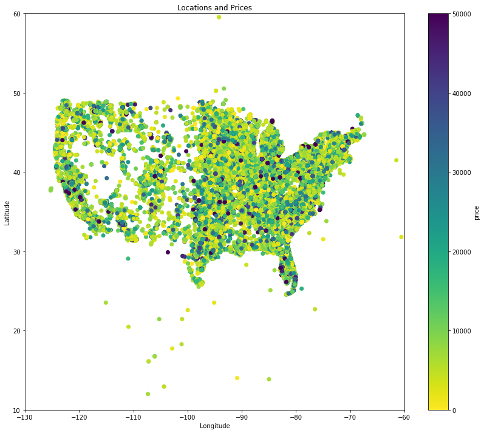
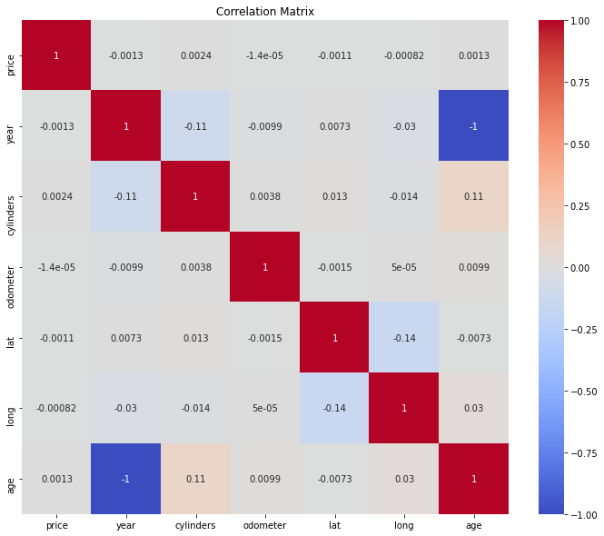
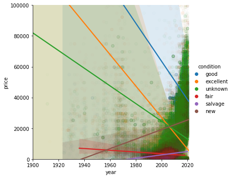
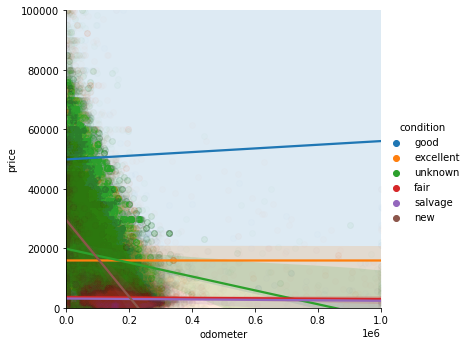
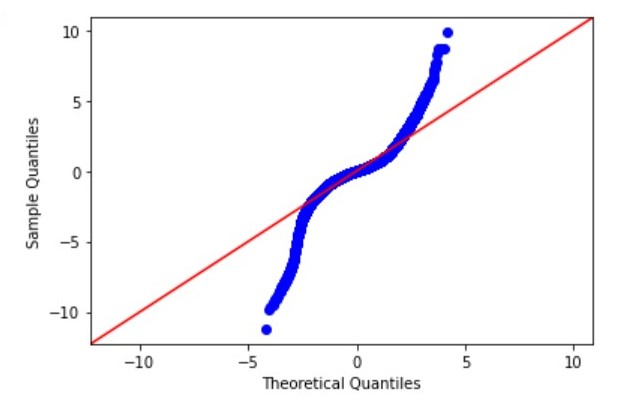

# Problem Statement

Buying a car is never an easy task, especially when buying a used one. So many different factors go into determining
the price of a vehicle that it’s difficult to accurately predict what one should be paying. Aside from this there 
are some parts of the country where used car sales are few and far between and the prices are not so desirable. 
Using scraped dataset of used car for sales from craigslist and to clarify some of these unknown variables and provide an easier experience for those searching for a car. To solve this we need an array of strategies to predict the price of the used car as accurate as possible.

# Import Data

The data for this project is obtained from kaggle datasets, it consists over 450000 entries and it's a listing on craigslist from October to December of 2020 used cars  for sale.<br>
The data is available on kaggle- https://www.kaggle.com/austinreese/craigslist-carstrucks-data?

This data is originally scraped by Austin Reese, it contains most relevant information that Craigslist provides on car sales including columns like price, condition, manufacturer, latitude/longitude, and 18 other categories. 

Our dataset contains over 450000 used vehicle sales  entries from Craigslist.org

The columns are as follows:

- **id** -   Unique identification number
- **url** -  Listing URL
- **region** - Craigslist region
- **region** - Region listing URL
- **price** - Listing price
- **year** -  Year of manufacturing
- **manufacturer** -  Manufacturing company
- **model** - Model of vehicle
- **condition** - Condition of vehicle
- **cylinders** - Number of cylinders
- **fuel** - String - Type of fuel required
- **odometer** - Miles traveled
- **title_status** - Vehicle title status/existence
- **transmission** - Transmission of vehicle
- **drive** -  Drive of vehicle
- **size** - Size of vehicle
- **type** - Type of vehicle
- **paint_color** - Color of vehicle
- **image_url** - Image URL
- **description** - Description about the sale
- **state** - 2 letter state abbreviation
- **latitude** - Latitude of listing
- **longitude** - Integer - Longitude of listing
- **posting_date** - Posting Date of the sale


# Scrub

This section contains all of the basic data cleaning 
- Important steps such as identifying and handling missing values in the columns.
- Merged and eliminated the values of columns to reduce the outliers.
- Dropped the column which are inconclusive.
- Transformed categorical variables by using one-hot encoding or "dummy variables".
- Binned the states column.

# Explore

**<font size = "4">Top 10 Manufacturer's Vehicle Sales Listing</font>**



Here we are looking at the distribution of the top 10 manufacturing companies in the dataset.If you prefer Ford vehicles, Ford has the highest number of vehicles available for purchase, meaning you have a large number of vehicles to choose from. They are followed by chevrolet and toyota. BMW has the lowest number of cars available for sale, so persons who prefer this brand may have a lower chance of finding their ideal vehicle.



**Noticed that most of the sale listing of vehicles in all the locations whose price is less than $30000**

We are observing the most of the vehicles available for sale are in Pacific and South Atlantic Division followed by East North Central Division

**<font size="4">
Correlation between the continuous variables</font>**



All numeric variables correlations are compared in this graph. Most variables aren't correlated at all, with the negative correlation between price and odometer, price and age and year, slight negative correlation between year and odometer.

**<font size ="4">Check for linearity</font>**



This linear line across our plot is the best available fit for the trend of the price with respect to the year vehicle was manufactured that gets generated. And the data points that we see at extreme top which are far away from this line are known as outliers in the dataset. We may think of outliers as exceptions.There is this shadow converging at center where there is a chunk of our data. This convergent point is actually the statistical mean,the generalized prediction of price of vehicles.Third parameter condition of the vehicle to linear regression plot,it shows vehicles with good condition are priced more compare to other condition.



In this plot  the price of the vehicle is high when miles(odometer) vehicles listed are low.
The blue line in plot shows that good conditioned vehicles are predicted higher price compare to other.

# Models

Performed different models on the dataset, noticed negative affect on R2-score of Baseline model then eliminated the outliers.

Eliminated the outliers in the price and odometer
- Price >500 and price < 50000
- odometer >20 and odometer<300000<br>

**<font size ="4">Summary of the models</font>**

| Model | Train mse | Test mse | R2
| :- |:------:|:------:| :-:
|Linear Regression| 43949336.94|44100238.79|0.65
|Random Forest| 44598084.57| 44755331.99|0.64
|Random Forest with Gridsearch|31241471.65|32856754.55|0.74
|Neural Network|48642697.53| 48622767.68|0.61
|Neutral Network Standardized data|22084242.59|23025315.26|0.82

# Conclusion

Comparing all the models, Neutral Network standardized data is the best model to predict price of the vehicle from dataset. Shown below the QQplot of the model.



Odometer and year  of the vehicles has big impact on the price of the vehicles.The condition, drive and manufacturer of vehicles also have effect on the price of vehicle. 


```python

```
